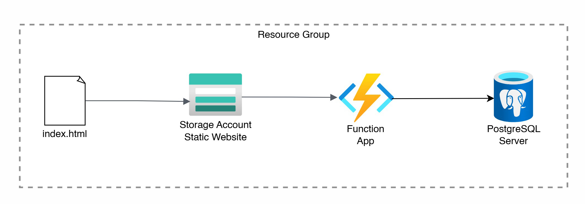

## Azure Architecture
This is the Azure System I built with Terraform. A serverless page lister, function app, is responsible for page navigation.
This is connected to PostgreSQL service which stores the texts in the blog. 

## How to Deploy
To deploy the application,

1. Fork the Git repo
2. Place these secrets in GitHub settings

`AZURE_CLIENT_ID`

`AZURE_SUBSCRIPTION_ID`

`AZURE_TENANT_ID`

Please note that this system can be authorized to use Azure by OIDC. Place related secrets to deploy it successfully. 

3. Create these secrets for db login

`POSTGRES_ADMIN_PASSWORD`

`POSTGRES_ADMIN_USERNAME`

On the actions tab, the app is deployable. 

4. To remove the system, go to Resource Groups in the Azure console and remove the TF state and blog app groups.

